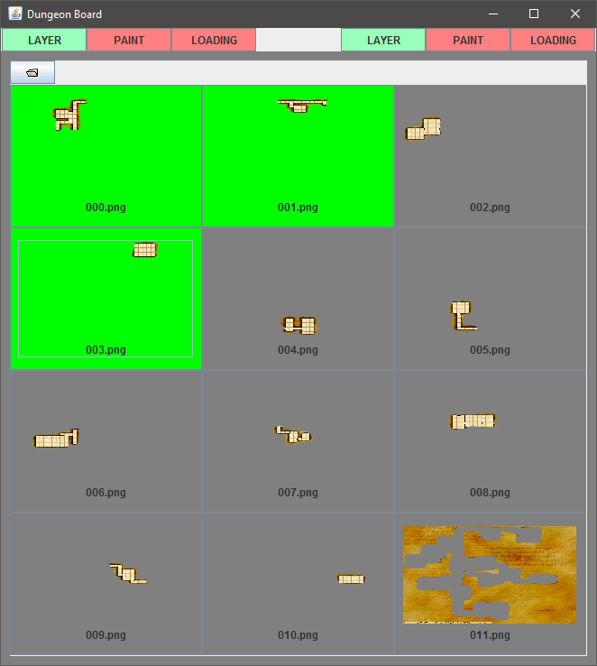
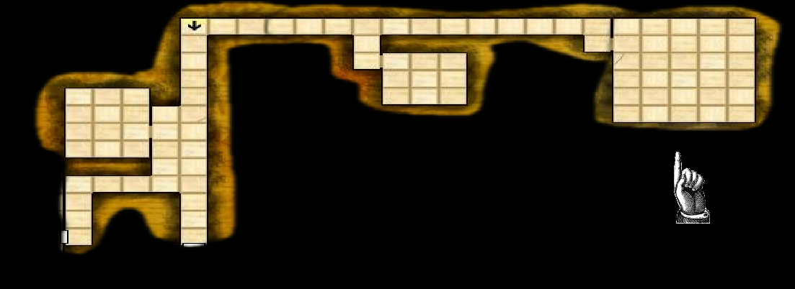

# DungeonBoard
A D&amp;D Map viewer for DMs to show players maps/dungeons without spoiling too much

## Examples
The following examples will show different use cases for the application.

### Paint ability
Painting onto a map to reveal known areas to players.
This is the Control Window, it will be only shown to the DM so they can edit behind the scenes.
 

 
This is the Display Window, it is what the players see on the screen.
Notice how only part of the map is displayed to the players, the DM can use the controls to change what they want the players to see.
In this example you can reveal more of the map as the players talk to NPCs and learn more about their world.
 

 
Here the DM is using the paint function to reveal sections of a dungeon.
This is the most likely use case for the paint function, since it is hard to predict what they players will do in a dungeon.
Being able to dynamically show and hide sections quickly is the main purpose of the painting ability.
 

 

### Layer ability
Unlike the paint ability this allows the DM to overlay different pictures ontop of each other.
The best use case would be for a world map, where you can apply layers that show hidden information not shown on the original map.
In this example the base map is displayed first, then the DM can choose to tell the players of specific areas like the Blacksmith or the Burial Grounds.
 

 
Here the DM has many different rooms that they can toggle the display of quickly.
This is useful in a dungeon where you want to reveal pre-determined areas, or if a room changes through a playthough.
 

 

### Loading ability
This ability is useful when the DM needs to kill some time.
The display will alternate randomly between all images in a directory.
The main use case is for the DM to show 'loading tips' to distract the players and also teach them about things they might not know they can do.

<a href="http://imgur.com/a/GB9kA">Exmaple Loading texts</a>

## Controls

