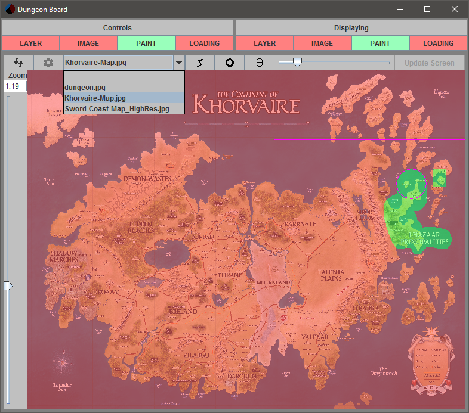
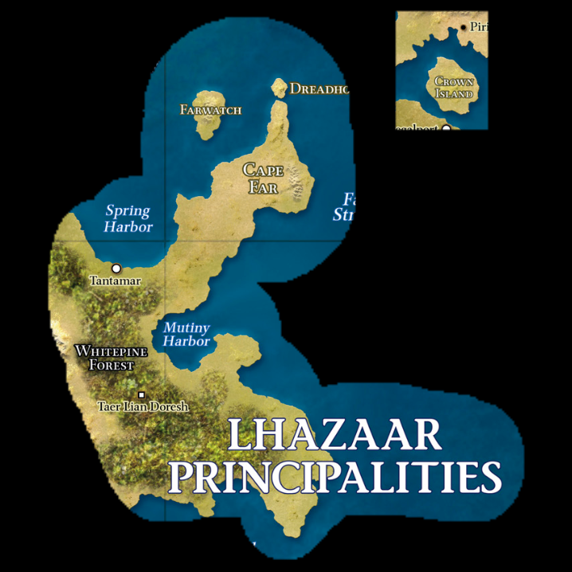
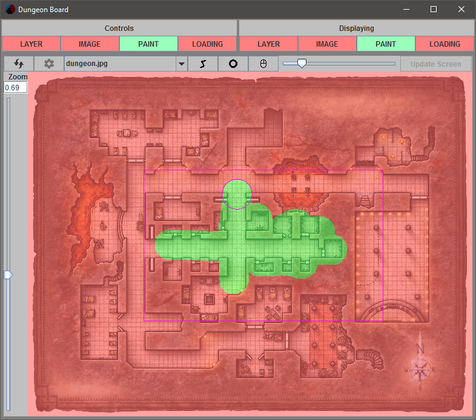
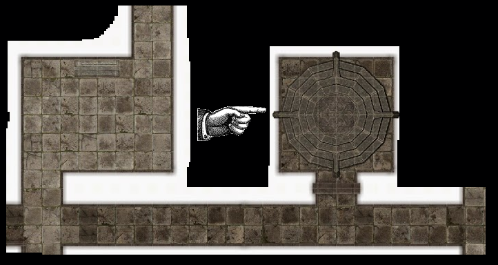
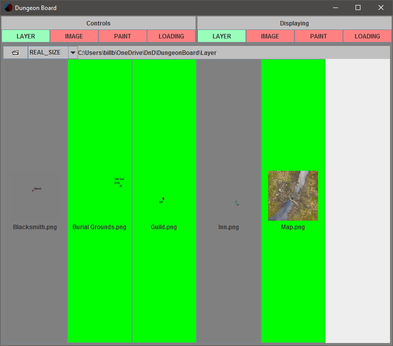
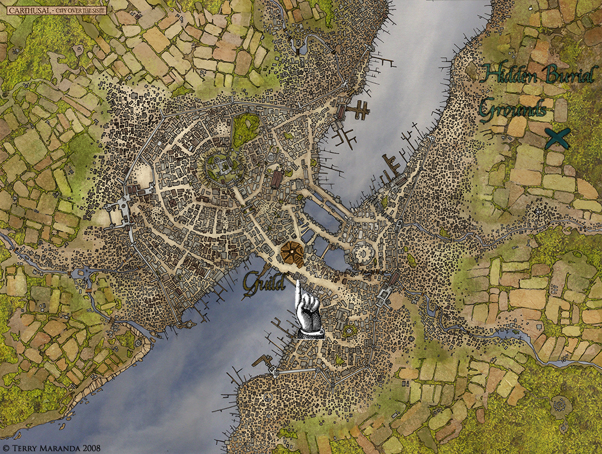
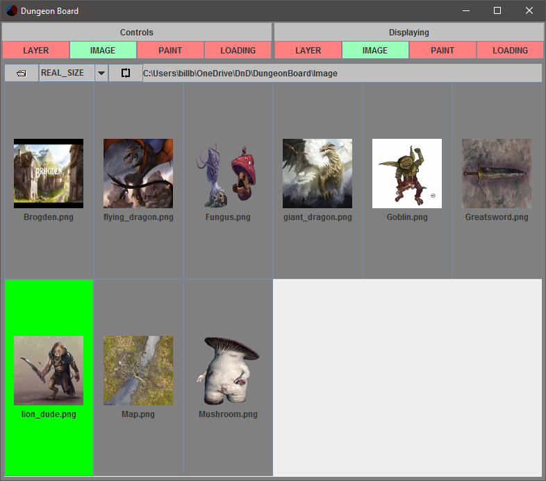
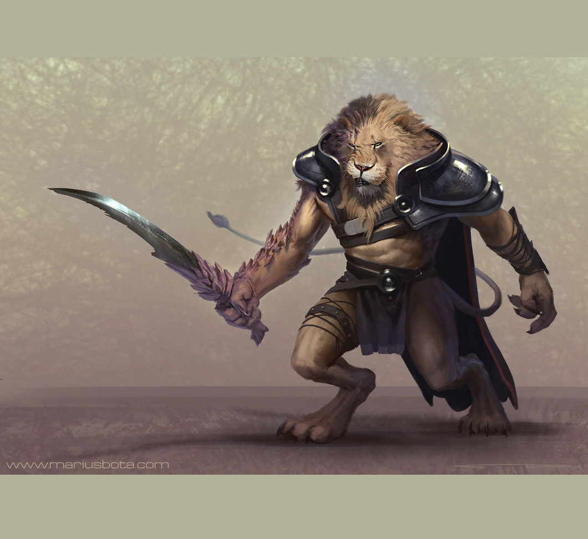
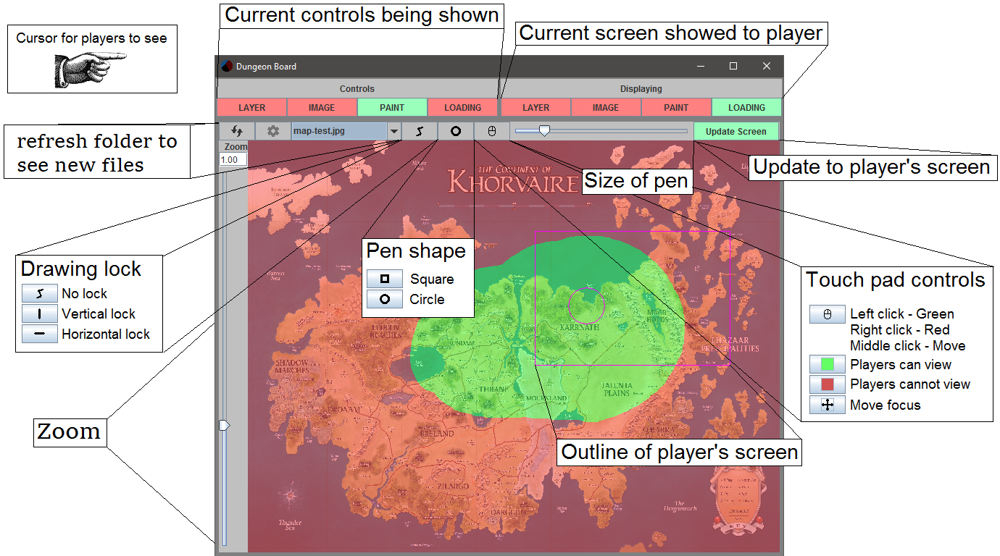

# Dungeon Board

A board game map viewer for DMs and GMs to show players maps/dungeons without spoiling too much

- [Examples](https://github.com/McAJBen/DungeonBoard#examples)
  - [Paint Utility](https://github.com/McAJBen/DungeonBoard#paint-utility)
  - [Layer Utility](https://github.com/McAJBen/DungeonBoard#layer-utility)
  - [Image Utility](https://github.com/McAJBen/DungeonBoard#image-utility)
  - [Loading Utility](https://github.com/McAJBen/DungeonBoard#loading-utility)
- [Controls](https://github.com/McAJBen/DungeonBoard#controls)
- [Running Dungeon Board](https://github.com/McAJBen/DungeonBoard#running-dungeon-board)

## Examples

The following examples will show different use cases for the application.

### Paint Utility

Painting onto a map to reveal known areas to players.
This is the Control Window, it will be only shown to the DM so they can edit behind the scenes.

This is the Display Window, it is what the players see on the screen.
Notice how only part of the map is displayed to the players, the DM can use the controls to change what they want the players to see.
In this example you can reveal more of the map as the players talk to NPCs and learn more about their world.

Here the DM is using the paint function to reveal sections of a dungeon.
This is the most likely use case for the paint function, since it is hard to predict what they players will do in a dungeon.
Being able to dynamically show and hide sections quickly is the main purpose of the painting ability.

### Layer Utility

Unlike the paint ability this allows the DM to overlay different pictures on top of each other.
The best use case would be for a world map, where you can apply layers that show hidden information not shown on the original map.
In this example the base map is displayed first, then the DM can choose to tell the players of specific areas like the Blacksmith or the Burial Grounds.

### Image Utility

This is similar to the Layer Utility, but will only show one image at a time.
This is useful when you want to simply use a screen to display a picture.

### Loading Utility

This ability is useful when the DM needs to kill some time.
The display will alternate randomly between all images in a directory.
The main use case is for the DM to show 'loading tips' to distract the players and also teach them about things they might not know they can do.
[Example Loading texts](http://imgur.com/a/GB9kA)

## Controls

## Running Dungeon Board

[Download 2.5.1](https://github.com/McAJBen/DungeonBoard/releases/download/v2.5.1/Dungeon.Board.v2.5.1.jar)

*Caution, web browsers do not like .jar files. They can be used to give viruses. Do your research before downloading (Don't take my word for it).*

**As of 2.5.0 Java 13 is a requirement to run this application.**

When you first run Dungeon Board it will create a folder next to the .jar file. Inside of this are 4 folders (Layer, Image, Paint, Loading). Simply place all of your images you want to display in these folders in the .png format.
The next time you run Dungeon Board it will automatically load these on startup.

If you want to run Dungeon Board with more memory allocated you have to run the .jar file from the command line.

    java -jar -Xmx2000m "Dungeon Board v2.5.1.jar"
